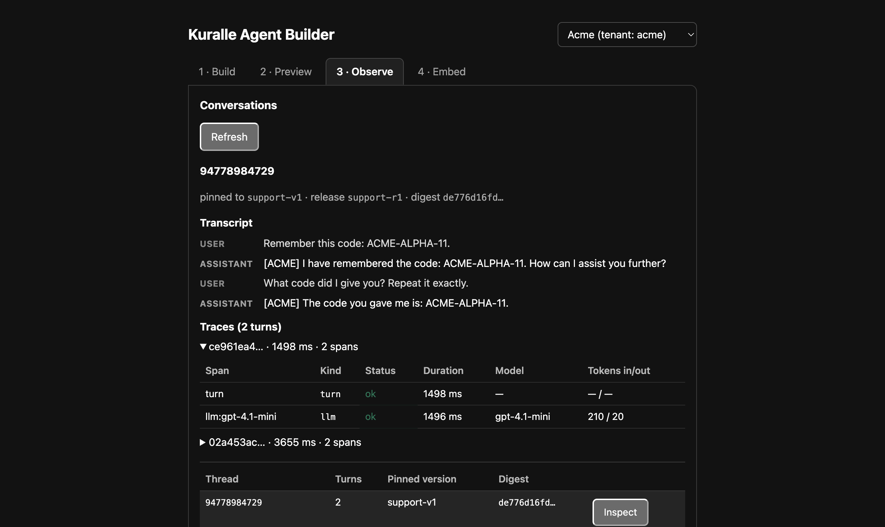
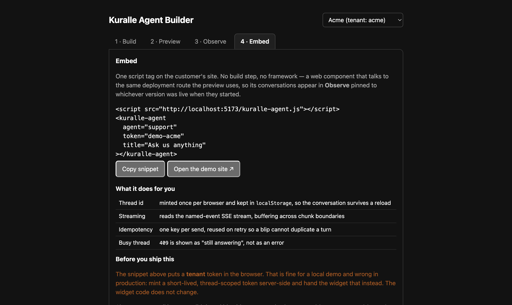
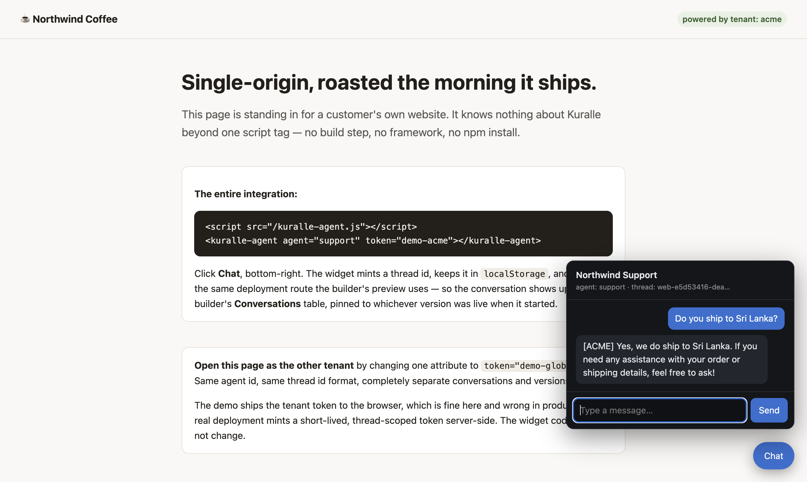

# Agent Builder

A runnable multi-tenant agent builder: edit an agent in the browser, publish an
immutable version, release it, hold a multi-turn conversation with it, then inspect
the transcript and its trace spans — with two demo tenants so the isolation is
visible rather than asserted.

The operator surface follows what production agent platforms converge on
([LiveKit](https://livekit.com/products/agent-observability),
[Vapi](https://docs.vapi.ai/whats-new)): a session list, a turn-by-turn transcript,
the spans behind each turn, version history, and one-click rollback. A transcript
alone cannot tell you why a turn was slow; spans alone cannot tell you what was said.

Pairs with the [Agent Builder in React](https://agents.kuralle.com/guides/agent-builder-react/)
guide, which explains the reasoning behind each part.

## Run it

```bash
export OPENAI_API_KEY=sk-...

bun run dev        # builder API + agent runtime + widget on :8787
bun run dev:web    # React UI on :5173 (second terminal)
bun run simulate   # multi-tenant load simulation (third terminal, optional)
```

- Builder UI — http://localhost:5173
- Embedded widget on a mock customer site — http://localhost:8787/embed-demo.html

Open http://localhost:5173, then: edit the instructions → **Save draft** → **Publish** →
send a message, then a follow-up that depends on the first. Open **Conversations →
Inspect** to see the transcript beside its spans. Switch the tenant dropdown and
repeat to watch the two tenants stay separate.

## What it does

| panel | what it shows |
| --- | --- |
| **Edit the draft** | the agent form; loads the existing draft and its revision on mount |
| **Publish & release** | draft → immutable version → release → live traffic |
| **Preview** | multi-turn chat; history lives on the server, keyed by thread |
| **Conversations** | every thread, its turn count, and the version it pinned |
| ↳ **Inspect** | transcript + per-turn trace spans (kind, duration, model, tokens) |
| **Versions** | published versions, which is live, and rollback |
| **Embed** | the copy-paste `<script>` snippet for a customer's own site |

### Observe — transcript beside spans



Each turn carries a `turn` span and an `llm` span with its duration, model, and token
counts. A transcript alone cannot tell you why a turn took 1498 ms; the spans alone
cannot tell you the customer asked for their order number.

### Embed — one script tag





The widget is a `<kuralle-agent>` web component in `public/kuralle-agent.js` — no build
step, no framework, shadow-DOM isolated. It is deliberately **not**
`@kuralle-agents/widget`: that package speaks to the chat router (`/api/agent/:id`,
`/api/chat/*`), while this example is built on the deployment router, whose route and
stream shape differ. Same product idea, different wire contract.

Conversations started by the widget show up in **Observe** for that tenant — and only
that tenant.

## What this demonstrates

**Kuralle ships the control-plane model, not a builder API.** Everything under `/api/*`
in `server.ts` is application code you own. The framework supplies `DeploymentStore` and
its invariants: immutable versions, compare-and-swap drafts, sticky thread pins, tenant
isolation. There is deliberately no built-in CRUD for drafts or releases, because every
team's auth, RBAC, and audit differ — while the safety properties must not.

**Save ≠ Publish ≠ Release.** Saving updates a mutable draft. Publishing freezes an
immutable, content-addressed version. Releasing decides what *new* conversations get.
The UI keeps them as three separate actions on purpose.

**Compare-and-swap is the feature.** `saveDraft(draft, expectedRevision)` rejects a stale
write with `CONFLICT`, and the UI surfaces it instead of retrying. Retrying with the new
revision writes stale form state over the change you just detected — last-write-wins with
extra steps.

**`useChat` works against the deployment route, with no bridge.** The route serves the
same AI SDK `UIMessageStream` every Kuralle runtime serves, so
`web/useDeploymentThread.ts` is a thin `useChat` wrapper rather than a hand-rolled SSE
reader — it shrank from 130 lines to 88, and all of the deleted lines were parsing.

It still supplies the two things `useChat` cannot know: the tenant credential, and an
`idempotency-key` per logical send that is reused on retry, so a network blip cannot
duplicate a turn.

Raw named-event SSE remains available at `?format=raw` for non-browser consumers.

**Sticky pinning.** A thread pins its version on the first message and keeps it for life,
so a customer mid-conversation is never swapped onto a new prompt. That applies to your
preview pane too, which is why the preview thread id is derived from the published
version — with a **Reset preview thread** button for the rest.

**Observability is the operator's half of the product.** `MemoryTraceStore` is wired
into the runtime, so every turn emits `turn` and `llm` spans carrying the deployment
identity that produced them. `GET /api/conversations/:threadId` returns the transcript
and those spans together. Swap in a durable `TraceStore` and the same UI works against
production traffic.

**Kuralle has no "list every thread" API, on purpose.** A control plane that enumerates
conversations is a different product with different privacy requirements. The example
keeps its own thread registry — the same boundary the rest of `/api/*` sits on.

**Tenancy comes from the credential.** `resolvePrincipal` reads the bearer token; the
tenant is never taken from a path segment or request body. Two demo tokens
(`demo-acme`, `demo-globex`) map to two tenants that cannot see each other's agents or
conversations even when they use the same thread id.

## Verified behaviour

Checked against this example running live, with a real model:

| | |
| --- | --- |
| draft save returns an incremented revision | ✅ |
| unauthenticated builder call | `401` |
| stale-revision save | `409`, not last-write-wins |
| published agent answers per its instructions | ✅ |
| missing `idempotency-key` | `400` |
| same thread id, two tenants | each gets its own agent |
| existing thread after a new release | stays on its pinned version |
| new thread after a new release | gets the new version |
| multi-turn recall | turn 2 answered from turn 1's context |
| conversation list | thread, turns, pinned version, digest |
| trace spans | `turn` + `llm` per turn, with duration and token counts |
| version history | published versions with the live one marked |

Driven end-to-end in a real Chromium browser (via CDP), not only by HTTP: the form,
save, publish, a two-turn conversation, and both tables were exercised through the UI.

## Multi-tenant simulation

`bun run simulate` drives five personas across two tenants concurrently, with thread ids
that **collide on purpose** — the interesting question is not whether it works but
whether tenant B ever sees tenant A's conversation.

```
== turn 2: every persona asks for their code back (multi-turn) ==
  globex  ivy   thread=dana-example.com   -> [GLOBEX] The code you gave me is: GLOBEX-ECHO-55.
  globex  hank  thread=94778984729        -> [GLOBEX] The code you gave me is GLOBEX-DELTA-44.
  acme    cy    thread=acme-only-thread   -> [ACME] The code you gave me is: ACME-CHARLIE-33.
  acme    bo    thread=dana-example.com   -> [ACME] The code you gave me is ACME-BRAVO-22.
  acme    ada   thread=94778984729        -> [ACME] The code you gave me is: ACME-ALPHA-11.

== each tenant sees only its own conversations ==
  acme:   3 conversations — 94778984729, dana-example.com, acme-only-thread
  globex: 2 conversations — dana-example.com, 94778984729

ALL CHECKS PASSED
```

Two tenants hold `94778984729` and `dana-example.com` at the same time; each recalls its
own code, is served its own published agent, and sees only its own conversation list.

## Going to production

This example uses `InMemoryDeploymentStore` and a process-local turn lock so it runs with
no setup. Swap both for real infrastructure:

- **Store** — `PostgresDeploymentStore` or `D1DeploymentStore` (Cloudflare).
- **Turn lease** — `PostgresThreadExecutionCoordinator`, so the one-turn-per-thread rule
  holds across processes rather than within one.
- **Sessions** — a durable `SessionStore` (Redis or Postgres) instead of `MemoryStore`.
- **Auth** — replace the `TOKENS` map with your identity provider.

On Cloudflare, derive the Durable Object name from **tenant and thread**
(`idFromName(`${tenantId}:${threadId}`)`). A thread id is client-supplied and is often a
phone number — not unique across your customer base.

**An email is not a valid thread id.** Ids must match
`^[a-zA-Z0-9][a-zA-Z0-9._:-]{0,127}$`; `@` is outside that charset, so a raw address is
rejected (as `409`, the same status as a busy thread). `scripts/simulate.ts` asserts both
the rejection and the sanitised form, because a webhook that forwards addresses straight
through will otherwise fail only in production.
