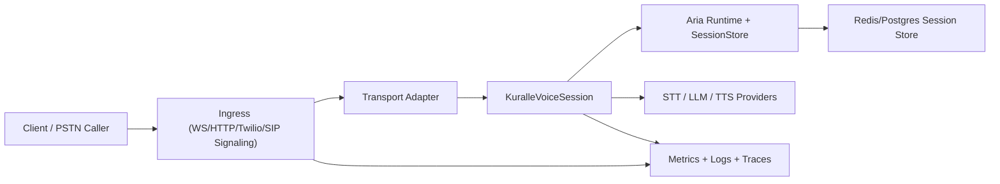

# Deployment Overview

## Why this guide exists

This guide defines how to deploy Kuralle + LiveKit transport adapters as a production voice platform, not just as demo examples.

Target outcome:

- predictable per-call session isolation
- clear transport boundaries
- horizontal scaling from low daily traffic to high daily traffic
- operational behavior that is comparable to commercial voice platforms

This document is the architecture baseline. Platform-specific deployment instructions are in:

- `05-deployment-fly-io.md`
- `06-capacity-and-transport-selection.md`

## External references used for this guide

- Pipecat Fly deployment pattern: [Pipecat Fly.io deployment guide](https://docs.pipecat.ai/deployment/platforms/fly)
- Fly autoscaling and concurrency behavior:
  - [Autostop/autostart Machines](https://fly.io/docs/launch/autostop-autostart/)
  - [App configuration (`fly.toml`)](https://fly.io/docs/reference/configuration/)
  - [Concurrency guidelines](https://fly.io/docs/apps/concurrency/)
- Telephony platform patterns:
  - [Vapi Phone Calling](https://docs.vapi.ai/phone-calling)
  - [Vapi Twilio SIP Integration](https://docs.vapi.ai/advanced/sip/twilio)
  - [Retell Concurrency and Limits](https://docs.retellai.com/deploy/concurrency)
  - [Retell Custom Telephony via SIP](https://docs.retellai.com/deploy/custom-telephony)
  - [ElevenLabs ElevenAgents overview](https://elevenlabs.io/docs/eleven-agents/overview)

## Design principles

### 1) One call equals one session identity

Every inbound call or client connection must map to one unique transport adapter ID and one runtime session ID for the full life of that call.

Do not reuse session IDs between concurrent calls.

### 2) Core package remains transport-neutral

`@kuralle/livekit-plugin` owns runtime/session semantics. Protocol details remain in transport packages:

- WS: `@kuralle/livekit-plugin-transport-ws`
- HTTP/SSE: `@kuralle/livekit-plugin-transport-http`
- Twilio: `@kuralle/livekit-plugin-transport-twilio`
- SIP RTP trunking: `@kuralle/livekit-plugin-transport-sip`
- SIP WS/WebRTC endpoint: `@kuralle/livekit-plugin-transport-sip-jssip`
- SmartPBX bridge adapter: `@kuralle/livekit-plugin-transport-smartpbx`

### 3) Separate control plane and media plane

At small scale, one process can host both.
At production scale, split responsibilities:

- Control plane:
  - auth, webhooks, routing, orchestration, health endpoints
- Media plane:
  - long-lived streaming sessions, STT/TTS/LLM turn loop, transport IO

### 4) Stateless workers, durable session state

Do not depend on in-process memory for business continuity.

Use Aria runtime store-backed sessions (`sessionStore`) for:

- durable context
- cross-restart recovery
- auditability and debugging

### 5) Deterministic teardown

On disconnect, stop, BYE, or fatal error:

1. close voice session once
2. close transport adapter once
3. remove state from active maps
4. emit final metrics and close reason

## Reference architecture



## Deployment topology options

### Option A: Single service (early stage)

Use when:

- <= 50 calls/day
- relaxed cold-start tolerance
- one region is acceptable

Characteristics:

- one deployable service
- one runtime process
- all transports in same process (or one selected transport)

Risk:

- noisy-neighbor behavior across transports
- harder to isolate outages

### Option B: Split by protocol edge (recommended default)

Use when:

- 50 to 1000 calls/day
- mixed traffic (browser + phone)
- stricter reliability requirements

Characteristics:

- separate deployables per major transport edge
- shared store and observability stack
- explicit capacity controls per transport

Typical split:

- `voice-ingress-ws-http`
- `voice-ingress-twilio`
- `voice-ingress-sip` (if SIP trunking is used)

### Option C: Control/media separation with shardable workers

Use when:

- 1000 to 3000+ calls/day
- strict p95 latency objectives
- burst handling is required

Characteristics:

- control service accepts and authorizes session setup
- media workers handle long-lived streaming sessions
- queue-based admission and backpressure
- per-region pools and canary deployments

## Transport selection at the architecture level

### WS transport

Best when you own both client and protocol. Lowest friction for custom real-time app UX.

### HTTP/SSE transport

Best when clients cannot keep custom WS channels, or where request/response semantics are required.

### Twilio transport

Best for PSTN entry through Twilio Media Streams. Mature path for phone traffic and webhook ecosystem.

### SIP RTP transport

Best for PBX/SIP-trunk integration with RTP media and codec constraints.

### SIP JsSIP transport

Best for SIP-over-WebSocket/WebRTC endpoint scenarios, not for RTP trunking.

### SmartPBX transport

Best when integrating to a SmartPBX event model while preserving core transport contract semantics.

## Runtime/session blueprint

```ts
import { Runtime } from '@kuralle-agents/core';
import { RedisSessionStore } from '@kuralle-agents/redis-store';
import { KuralleVoiceSession } from '@kuralle/livekit-plugin';
import { TwilioAgentServer } from '@kuralle/livekit-plugin-transport-twilio';
import { initializeLogger } from '@livekit/agents';

initializeLogger({ pretty: false, level: process.env.LOG_LEVEL ?? 'info' });

const runtime = new Runtime({
  agents,
  defaultAgentId: 'assistant',
  defaultModel: openai('gpt-4o-mini'),
  sessionStore: new RedisSessionStore({
    client: redisClient,
    prefix: 'aria-voice-prod',
    sessionTtlSeconds: 3600,
  }),
});

const server = new TwilioAgentServer({ port: 3000 });

server.onCall(async (callId) => {
  const voiceSession = new KuralleVoiceSession({
    runtime,
    stt,
    tts,
    greeting: null,
  });

  // SessionManager binds transport identity to runtime session context.
  await server.startSession(callId, voiceSession);
});

await server.listen();
```

## Production controls you should have before launch

### Reliability

- min running instances per critical region
- graceful shutdown and connection draining
- restart strategy that avoids duplicate session processing

### Security

- webhook signature validation for telephony providers
- strict auth on control-plane endpoints
- secrets managed by deployment platform, not `.env` in production

### Observability

- per-call correlation IDs (`callId`, provider ID, transport ID, runtime session ID)
- session lifecycle logs (start, active, stop, reason)
- queue depth, active session count, turn latency, output backpressure metrics

### Cost control

- concurrency budget alarms
- hard admission limit to avoid uncontrolled scaling
- idle session timeout and cleanup

## What "platform-grade" means in this project

To behave like a serious voice platform, you need:

- transport composability
- deterministic session isolation
- predictable scaling controls
- clear failure domains
- test coverage for protocol contracts and teardown

The next two guides turn this into deployable steps and capacity policy:

- `05-deployment-fly-io.md`
- `06-capacity-and-transport-selection.md`
