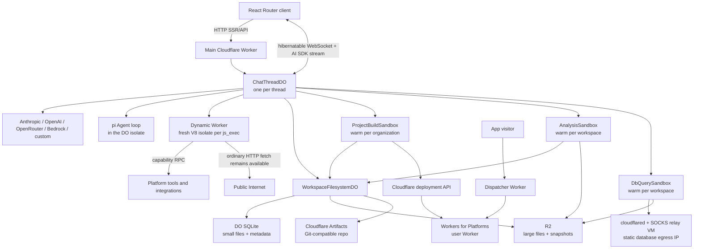

# camelAI: first-principles architecture and substrate analysis

Research date: 2026-07-29

Article: [Our coding agent runs in a Cloudflare Durable Object, not a VM](https://camelai.com/blog/our-coding-agent-runs-in-a-cloudflare-durable-object-not-a-vm) (2026-07-28)

Repository: [`qaml-ai/camelAI`](https://github.com/qaml-ai/camelAI), inspected at `616aa52fbaca26bcddf18364e6257575bd9a7c52`

The local source and dependency clones used for the audit are intentionally ignored. camelAI pinned `@earendil-works/pi-agent-core@0.80.6`; that tag was inspected at commit `2b3fda9921b5590f285165287bd442a25817f17b`.

## Executive verdict

camelAI is best understood as an actor-based control plane for an AI software factory, not as a coding agent somehow squeezed into one serverless function.

The central architectural move is to separate five concerns that a traditional coding-agent VM conflates:

1. **Reasoning and coordination** — a `ChatThreadDO`, one per chat thread.
2. **Durable source state** — a filesystem actor backed by Durable Object SQLite and R2.
3. **Short, capability-oriented computation** — model-written JavaScript in a fresh Dynamic Worker isolate.
4. **Heavy or OS-dependent computation** — disposable Cloudflare Sandbox Linux containers for builds, notebooks, and database queries.
5. **Published user workloads** — Workers for Platforms user Workers behind a dispatcher.

That split is the real innovation. The headline “not a VM” is directionally correct about the **agent brain**, but incomplete about the whole system. The checked-in implementation still uses Linux containers for three workload classes, and its static-IP database path still depends on a separately managed VM relay. The code also keeps build and analysis containers warm by stable organization/workspace IDs instead of explicitly destroying them after every call.

The system gains lower idle cost, faster first-token response, explicit authority boundaries, and platform-managed horizontal scale. It pays with distributed-state complexity, cross-object consistency problems, a narrower tool universe, Cloudflare product coupling, and more application code devoted to recovery and substrate adapters.

## The first-principles decomposition

A coding agent needs only a few irreducible capabilities:

- accept messages and stream progress;
- call an LLM repeatedly;
- retain a canonical transcript and recover interrupted turns;
- read and mutate a source tree;
- invoke tools with scoped authority;
- run computations that need a language or OS runtime;
- build, deploy, observe, and roll back an application.

A VM is one way to bundle all of those. camelAI instead assigns each capability to the cheapest substrate that satisfies its invariants:

| Requirement | Needed invariant | camelAI substrate |
| --- | --- | --- |
| Conversation ownership | one serialized authority per thread | `ChatThreadDO` |
| Agent continuity | durable checkpoints across isolate eviction | DO SQLite/KV plus turn journals |
| Small source files | low-latency transactional metadata and bytes | `@cloudflare/shell` on DO SQLite |
| Large source files | durable, cheap blob storage | R2 spill objects |
| Source rollback | immutable, content-addressed versions | custom R2 snapshots + DO manifest/index |
| Git interoperability | Git-compatible remote repository | Cloudflare Artifacts |
| Agent-generated scripting | fast, isolated JS with explicit bindings | Dynamic Workers / Code Mode |
| Package installation and Vite builds | Linux, Bun, more than 128 MB | Project Build Sandbox container |
| Python/Jupyter analysis | Linux, Python packages, mounted data | Analysis Sandbox container |
| Customer SQL connections | DB drivers and controlled/static egress | DB Query Sandbox + relay VM |
| Published user apps | multi-tenant untrusted Workers | Workers for Platforms |
| Global indexes and administration | cross-entity queries | D1 |
| Cheap routing/session lookups | globally accessible key/value state | KV |
| Asynchronous ingress/work | retryable delivery | Queues |
| Logs and analytical telemetry | write-heavy observability | Analytics Engine, Tail Workers, Pipelines/R2 |

This is a control-plane/data-plane architecture. The Durable Objects decide and coordinate; isolates and containers execute; R2 and SQLite remember; Workers for Platforms serves the result.

## System map



## One chat turn, end to end

1. The browser connects to the Agents SDK route named `chat-thread`, using the thread ID as the Durable Object name.
2. The main Worker authenticates the WebSocket request and injects trusted organization, workspace, user, and thread context before routing it to the object.
3. `ChatThreadDO`, which extends `AIChatAgent`, admits the message. Its constructor synchronously initializes SQLite-backed state, restores coarse state, and configures hibernatable WebSocket behavior.
4. The object lazily creates a pi `Agent`. The LLM loop, tool scheduling, steering, and event emission run inside this object—not inside the Dynamic Worker and not in Linux.
5. A canonical `pi_core_*` transcript feeds the model. A separate AI Chat message store exists for browser rendering. An idempotent high-watermark mirror reconciles one into the other.
6. The active turn is journaled before and during execution. A cold object can reconstruct the pi session, repair incomplete tool-call pairs, and retry or continue under a bounded recovery policy.
7. Native file tools call `WorkspaceFilesystemDO`. `js_exec` creates a fresh Dynamic Worker and passes only RPC capabilities. Build, notebook, or SQL methods call their respective Sandbox-backed Durable Objects.
8. pi lifecycle events are translated into AI SDK `UIMessageStream` chunks, streamed over the hibernatable socket, and persisted for reconnect/replay.
9. On deployment, source is snapshotted, the build output is validated, and a Worker plus static assets is uploaded into a Workers for Platforms dispatch namespace.

The important boundary is this: **pi owns an in-memory agent run; camelAI owns durable admission, persistence, recovery, authorization, and UI reconciliation around it.**

## The agent brain

camelAI uses `@earendil-works/pi-agent-core@0.80.6` and `@earendil-works/pi-ai@0.80.6`. It instantiates the low-level `Agent` directly rather than using the higher-level coding-agent package or `AgentHarness`.

pi provides:

- the provider-neutral agent loop;
- streamed assistant/thinking/tool-call events;
- sequential or parallel tool execution;
- argument validation;
- steering and follow-up queues;
- abort and settlement semantics;
- mutable model, prompt, tool, and transcript state.

camelAI supplies everything pi deliberately does not:

- thread identity and tenancy;
- WebSocket admission and resumability;
- canonical persistent transcript;
- interrupted-turn journal and recovery;
- model entitlement, provider credentials, billing, and usage;
- context compaction and image hydration;
- file, integration, deployment, communication, and browser tools;
- conversion from pi events/messages to AI SDK UI messages.

The pi dependency itself documents why this division is necessary: a fully durable harness cannot serialize tool implementations, provider/auth objects, hooks, and resource loaders. Its durable-harness document describes a future “semi-durable” design and explicitly lists durable queues, operation markers, provider requests, and tool-call recovery as work still required. camelAI has implemented its own concrete version of those boundaries in `ChatThreadDO`.

### Tool topology

The top-level model sees a deliberately small tool set:

- native read/write/edit/delete/list/search operations;
- `js_exec`;
- selected project/application lifecycle actions;
- focused child agents such as Explore/Agent and capability agents such as Research.

The long tail of platform operations is discoverable inside `js_exec` through `tools.search`, `tools.describe`, and `tools.help`. This is Code Mode's context-saving pattern: teach the model one programming interface and let it discover specific methods only when needed.

This improves model tractability, not merely security. Smaller models generally perform better when the action grammar is explicit and schemas are discoverable than when they must improvise arbitrary shell commands.

## Durable chat is the hard part

The most technically significant code is not the tool list. It is the recovery machinery around a process that Cloudflare is allowed to evict.

Durable Objects are single-threaded actors with colocated strongly consistent storage, but their memory is not durable. A hibernateable object can lose memory after roughly ten seconds idle; non-hibernateable objects can be evicted later. camelAI therefore treats the pi `Agent` object as a cache, never as the source of truth.

The thread object maintains:

- a canonical pi transcript;
- a browser-render transcript;
- a durable active-turn marker with a stable turn ID;
- a queued/steered input journal;
- recovery attempt counts;
- partial stream/UI reconciliation state;
- context-window and compaction metadata.

Recovery does not resume a provider TCP stream. It reconstructs a valid transcript boundary, repairs or synthesizes interrupted tool results where necessary, rebuilds pi, and regenerates or continues the visible message under a stable identity. This is at-least-once orchestration with application-level idempotency, not magical continuation of arbitrary JavaScript stack frames.

## Filesystem and versioning

`WorkspaceFilesystemDO` wraps Cloudflare's experimental `@cloudflare/shell@0.3.7` `Workspace` class.

There are two addressing levels:

- a workspace filesystem actor for workspace-scoped files and project metadata;
- a project filesystem actor for each globally normalized project ID.

The storage policy is:

- files below `1_500_000` bytes are stored inline in the DO's SQLite-backed workspace table;
- larger files spill into R2 and leave a pointer/metadata row in SQLite;
- same-path mutations are serialized by an in-memory queue;
- binary and streamed reads/writes are supported;
- paths are normalized and sensitive paths such as `.git` are excluded from project materialization.

The 1.5 MB cutoff is a practical consequence of the DO SQLite row/blob/key-value ceiling, which is 2 MB. It leaves room for encoding and metadata instead of driving directly into the platform limit.

R2 is strongly consistent for binding/S3 reads, writes, deletes, metadata, and list operations. That makes the spill layer much easier to reason about than an eventually consistent object store, but a file mutation is still a multi-store operation. The code—not R2—must maintain the SQLite-pointer/R2-object invariant and clean up orphans.

### “Git history” is not the whole source-history story

Projects receive an Artifacts repository and can mint scoped Git tokens. Artifacts is Git-compatible, versioned storage, but it is still closed beta as of this research date.

The product-visible `list_commits` and `revert_project` implementation does **not** enumerate Git commits. It enumerates camelAI's own project source snapshots:

- each snapshot has a DO-stored manifest;
- each file body is a content-addressed R2 blob;
- snapshot IDs are used as deploy `commit_sha` values;
- restore rewrites the current project tree from the snapshot.

No normal project-edit path in the inspected code runs `git add`, `git commit`, or `git push`. Artifacts repositories are provisioned and exposed as interoperable remotes, while the live filesystem and user-facing rollback history are presently DO/R2-native. The article's “version history still runs through Artifacts” is therefore at least incomplete for this commit.

## Code Mode and Dynamic Workers

For each `js_exec`, `ChatThreadDO` constructs a Dynamic Worker module containing the model-written JavaScript and invokes a `CodeModeRunner` entrypoint.

The child Worker receives capabilities, not raw secrets:

- a tool RPC binding scoped to org/workspace/user/thread;
- virtual AI and camelAI services;
- deployed-app fetch routing;
- screenshot and browser services;
- connection, project, workspace, and communication facades.

The parent retains credentials and context in `WorkerEntrypoint` props. Cloudflare's RPC model hands the child an unforgeable stub exposing only the methods on that entrypoint.

The runner also:

- strips TypeScript syntax with Sucrase;
- auto-returns a final top-level expression;
- captures console output;
- coarsens `Date` and removes `performance`, `SharedArrayBuffer`, and `Atomics`;
- adds tool discovery/help and bounded equivalent-retry behavior;
- races execution against an application-level timeout.

### Egress is not actually deny-by-default

Cloudflare Dynamic Workers support `globalOutbound: null`, which blocks `fetch()` and `connect()`, or an outbound gateway that can enforce a network policy. camelAI's normal `js_exec` loader sets neither.

The runner replaces `globalThis.fetch` with `SecureFetchBinding.fetch`, but that binding only intercepts known workspace-app hostnames so it can route and authenticate them through the dispatcher. For other HTTP(S) hosts, it falls through to native `fetch`. Redirects from a workspace app to an external host also fall through after sensitive headers are stripped.

So the precise guarantee is:

- privileged platform credentials remain outside the child;
- platform methods are capability-scoped;
- workspace app access is checked and routed;
- arbitrary external HTTP(S) access is still available.

That may be the intended product policy, but it is not the strongest isolation mode described in Cloudflare's Dynamic Worker documentation. If deny-by-default egress is desired, the loader should set `globalOutbound` to `null` or to an explicit policy gateway. Patching `globalThis.fetch` is also a weaker choke point than a runtime-level global outbound interceptor.

The timeout is a `Promise.race`; it bounds how long the caller waits but is not, by itself, proof of a hard CPU/isolate termination. The loader code also does not set per-child `cpuMs` or `subRequests` limits. Platform defaults and lifecycle cleanup still apply, but a security review should make the intended hard limit explicit.

## Where Linux still exists

### Project builds

`ProjectBuildSandbox` is a `standard-4` Cloudflare Sandbox container. It is keyed by organization, so projects within one organization reuse a warm container. The source of truth remains the project filesystem actor.

For a build, camelAI:

1. lists and hashes up to 50,000 source files;
2. materializes changed files into `/workspace/<projectId>` and tracks a source manifest;
3. runs a fixed Bun install/build command with a default two-minute timeout;
4. copies lockfile and build logs back to durable project storage;
5. validates the generated Wrangler/module/assets manifest;
6. produces the deployment payload.

The build script itself is user-controlled and dependency installation executes package lifecycle code, so the container is a real untrusted-code boundary. The isolation unit is the organization, not the individual project. Warm state is a cache and disappears when the Sandbox sleeps.

### Analysis and notebooks

`AnalysisSandbox` is keyed per workspace, with a separate `app-<workspace>` sandbox for code executing on behalf of a deployed application. It includes Python, `uv`, Jupyter, pandas, NumPy, Polars, DuckDB, and related packages.

The agent-facing analysis sandbox receives:

- project files synchronized into per-run work directories;
- read-only R2 mounts for uploads and warehouse exports;
- a separate writable output mount;
- intercepted access to `connections.internal` with org/workspace identity held Worker-side;
- an outbound allowlist centered on PyPI and the internal connection host.

The deployed-app analysis sandbox is intentionally separate so app code cannot inherit the agent sandbox's project files, uploads, or data-connection capability.

### Database query runtime and the remaining VM

`DbQuerySandbox`, also keyed per workspace, runs trusted query code rather than arbitrary model code. The Worker sends the query runner over stdin for each operation; the image contains Node, DB drivers, Parquet support, SOCKS support, and `cloudflared`.

Authorization happens before the request reaches the container. In relay mode the path is:

```text
DbQuerySandbox -> cloudflared Access TCP -> Cloudflare Tunnel -> gost SOCKS relay -> customer database
```

The relay host is a VM with a static public IP so customers can allowlist database egress. The query runner and the relay both apply private/link-local/loopback protections. If relay configuration is entirely absent, the code deliberately permits direct container egress without a static-IP guarantee; partial configuration fails closed as a configuration error.

This is the clearest exception to the article's “we no longer run any of that infrastructure.” It is not an always-on per-user coding VM, but the current product still has a VM in its database networking substrate.

## Deployment substrate

`deploy_project` first creates a source snapshot, then builds and uploads the resulting Worker into a Workers for Platforms dispatch namespace. The deployed script name is namespaced by organization slug.

A separate dispatcher Worker:

- resolves platform and custom hostnames;
- enforces public/private access policy;
- selects the user Worker with `env.DISPATCHER.get(name)`;
- forwards the request and can mediate platform bindings.

Workers for Platforms gives each uploaded user Worker an isolated untrusted-mode runtime and allows per-customer limits and observability. Virtual bindings let user applications consume platform capabilities without receiving raw account-wide Cloudflare resources.

Deploy artifacts and static asset blobs are cached in R2 to support rollback. An app-usage-guard Worker periodically reads platform telemetry and can quarantine or roll back over-limit applications. Tail Workers and a `WorkerLogsDO` surface per-app logs.

## The identity and state model

camelAI does not use one central relational database as the authority for everything. It shards authority by domain identity:

- `UserDO` — user profile, memberships, user-facing views and usage state;
- `OrgDO` — organization membership, model/provider settings, billing, deployed scripts/apps;
- `WorkspaceDO` — workspace metadata, explicit access, encrypted integrations, audit state;
- `ChatThreadDO` — one conversation and its agent runtime;
- `WorkspaceFilesystemDO` — workspace/project file state;
- registry DOs — email handles, Slack teams, Telegram identities, organization slugs;
- `WorkspaceCronDO` — scheduled prompts and automation definitions/runs.

D1 is used as a cross-entity/index/admin database rather than the sole source of truth. KV handles cheap globally routed lookups such as sessions and app registries. This avoids a single database bottleneck, but cross-DO changes cannot share one transaction. The application needs idempotency, reconciliation, compensating cleanup, and explicit index-refresh paths.

## Product planes beyond the article

The open-source application is much broader than the coding loop:

- React Router SSR application and live chat UI;
- OAuth, password, enterprise OIDC, Cloudflare Access, and self-hosted Pomerium auth modes;
- organization memberships, workspace access, quotas, Stripe billing, and BYOK model providers;
- Slack, Discord, Telegram, and email ingress/egress;
- OAuth/API/database/remote-MCP connections;
- scheduled prompts and deterministic JavaScript workflows;
- browser capture and screenshot queues;
- transcript/tool-call lake pipelines to R2/Iceberg-style catalog storage;
- Analytics Engine events, Tail Workers, and administrative dashboards;
- Docker Compose/workerd self-hosting with a local Artifacts substitute.

The repository is therefore closer to a multi-tenant application-generation platform than a standalone coding agent.

## Economics and scaling consequences

### What gets cheaper

- An idle thread does not reserve a VM, disk, or container.
- Hibernatable WebSockets let the thread actor leave memory while the connection stays open.
- Source durability is billed as stored rows/objects, not attached always-on disks.
- Most tool computations use millisecond-starting isolates.
- expensive Linux is demand-loaded and reused briefly as a cache.
- each thread/project/workspace actor scales independently.

### What can become a bottleneck

- One thread maps to one single-threaded actor. That is an excellent consistency boundary for human chat, but an individual object is still a hotspot with platform request/CPU/storage limits.
- DO placement is near the first request, not continuously mobile. Later collaborators elsewhere may cross regions.
- Every cross-DO call is a distributed call and cannot join the caller's SQLite transaction.
- A project DO has finite SQLite metadata capacity even if bodies spill to effectively larger R2 storage.
- Stable per-org/per-workspace Sandbox IDs provide warmth but create a coarse noisy-neighbor and trust boundary.
- Artifacts and Dynamic Workers are comparatively new platform dependencies; Artifacts is closed beta.

### Cost claims that cannot be independently verified from the repo

The article says the architecture is cheaper by orders of magnitude and compares thousands of Dynamic Worker executions with minutes of container time. The repository demonstrates why that direction is plausible, but it contains no before/after workload, invoice, latency distribution, or normalized cost model. Treat the magnitude as a vendor/operator claim, not a reproduced benchmark.

## Article claims versus inspected implementation

| Article shorthand | What the inspected code shows |
| --- | --- |
| “The agent runs in a Durable Object” | Correct. The LLM/agent loop is in `ChatThreadDO`; tools fan out to other substrates. |
| “Each thread gets its own DO” | Correct; the browser names the agent with the thread ID. |
| “The filesystem lives in SQLite and R2” | Correct; `@cloudflare/shell` stores small files inline and spills at 1.5 MB. |
| “Version history runs through Artifacts” | Incomplete. Artifacts repos are provisioned, but `list_commits`/revert/deploy history uses custom DO/R2 snapshots. |
| “Credentials never enter the sandbox” | Correct for privileged platform capabilities; bindings retain secrets parent-side. |
| Implied restricted sandbox networking | Not generally true for `js_exec`; external fetch falls through to the Internet and `globalOutbound` is unset. |
| “A build spins up a container … and shuts it down” | The code uses a stable per-org Sandbox ID and does not explicitly destroy it; default idle sleep eventually discards it. |
| “Notebook runs work the same way” | Similar synchronization model, but the analysis sandbox is stable per workspace and deliberately warm. |
| “No external container services to manage” | No bespoke per-user container service; Cloudflare Sandbox remains a managed container substrate. |
| “We no longer run any of that [VM] infrastructure” | The per-user coding VM is gone, but a static-IP database egress relay VM remains. |
| “10 GB DO SQLite cap” | The limits page and product configuration should be checked per account; Cloudflare's current overview page contains a contradictory 10 GB statement and 1 GB footnote. |

## Security assessment

Strong choices:

- authentication before Durable Object routing;
- one actor per thread and tenant-scoped capabilities;
- credentials held behind RPC entrypoints;
- separate app and agent analysis sandboxes;
- R2 mounts scoped by prefix and read-only where possible;
- fixed build orchestration commands and output validation;
- database authorization before the trusted runner, plus SSRF defenses in two layers;
- published user code isolated as Workers for Platforms scripts;
- durable turn recovery instead of trusting isolate memory.

Questions worth resolving before treating the system as a hardened reference architecture:

1. Should normal Code Mode use `globalOutbound: null` or an explicit gateway?
2. Are hard Dynamic Worker CPU/subrequest limits configured elsewhere, or is the `Promise.race` the only js-exec time bound?
3. Is per-organization build-container reuse the intended isolation level for mutually distrusting workspace members/projects?
4. What reconciler repairs SQLite/R2 file-pointer divergence and orphaned snapshot blobs after partial failures?
5. What is the intended relationship between Artifacts history and the separate source-snapshot history?
6. How are cross-DO identity/index writes reconciled after one side commits and another fails?
7. Is direct DB egress acceptable in environments where relay configuration is absent?
8. What is the operational replacement plan for the remaining static-IP VM relay?

## Architectural lessons transferable to other systems

1. **Make the agent an actor, not a machine.** Give each conversation one serialized owner and treat its in-memory harness as disposable.
2. **Persist semantic boundaries, not runtime stacks.** Journal messages, tool outcomes, and turn state; rebuild after eviction.
3. **Separate source truth from compute caches.** Containers should be rehydratable from durable storage and may disappear at any time.
4. **Use capability APIs for privileged operations.** Keep credentials on the trusted side of an RPC boundary.
5. **Retain Linux only where the workload genuinely requires it.** Package managers, native builds, Python notebooks, and DB drivers are reasonable exceptions.
6. **Keep deployment isolation separate from agent-code isolation.** A one-shot code-mode script and a long-lived published application have different trust and lifecycle needs.
7. **Expect distributed consistency work.** Actor sharding removes central contention but moves complexity into idempotency and reconciliation.
8. **Narrow tools to improve reliability as well as security.** Explicit methods turn ambiguous shell behavior into auditable product operations.

## Primary-source ledger

Repository sources:

- [`source/README.md`](source/README.md) — product and architecture overview.
- [`source/wrangler.prod.jsonc`](source/wrangler.prod.jsonc) — deployed bindings, containers, DOs, R2, D1, KV, queues, workflows, and telemetry.
- [`source/workers/main/src/chat-thread-do.ts`](source/workers/main/src/chat-thread-do.ts) — thread actor, pi integration, Code Mode loader, streaming, and recovery.
- [`source/workers/main/src/chat-thread/`](source/workers/main/src/chat-thread/) — canonical transcript, turn journal, UI mirror, compaction, tool surface, and observability collaborators.
- [`source/workers/main/src/code-mode-runner.ts`](source/workers/main/src/code-mode-runner.ts) — generated execution runtime.
- [`source/workers/main/src/workspace-app-fetcher.ts`](source/workers/main/src/workspace-app-fetcher.ts) — secure-fetch routing and external fallback.
- [`source/workers/main/src/workspace-filesystem-do.ts`](source/workers/main/src/workspace-filesystem-do.ts) — SQLite/R2 filesystem, Artifacts provisioning, and source snapshots.
- [`source/workers/main/src/project-build-service.ts`](source/workers/main/src/project-build-service.ts) and related build modules — source materialization and builds.
- [`source/workers/main/src/analysis-service.ts`](source/workers/main/src/analysis-service.ts) — notebook/analysis sandbox tenancy, mounts, and sync.
- [`source/workers/main/src/db-query-sandbox.ts`](source/workers/main/src/db-query-sandbox.ts) and [`db-query-service.ts`](source/workers/main/src/db-query-service.ts) — trusted SQL runtime and static egress.
- [`source/workers/main/src/direct-dispatch-deploy.ts`](source/workers/main/src/direct-dispatch-deploy.ts) — deployment and rollback cache.
- [`source/workers/dispatcher/`](source/workers/dispatcher/) — published-app routing.
- `@earendil-works/pi-agent-core` tag `v0.80.6` — exact pi agent implementation used by the inspected camelAI commit (local audit clone intentionally not committed).

External primary sources:

- [Durable Objects concepts](https://developers.cloudflare.com/durable-objects/concepts/what-are-durable-objects/)
- [Durable Object lifecycle](https://developers.cloudflare.com/durable-objects/concepts/durable-object-lifecycle/)
- [Durable Object limits](https://developers.cloudflare.com/durable-objects/platform/limits/)
- [SQLite-backed Durable Object storage](https://developers.cloudflare.com/durable-objects/api/sqlite-storage-api/)
- [Cloudflare AI chat agents (`AIChatAgent` and `useAgentChat`)](https://developers.cloudflare.com/agents/communication-channels/chat/chat-agents/)
- [Dynamic Workers](https://developers.cloudflare.com/dynamic-workers/)
- [Dynamic Worker custom bindings](https://developers.cloudflare.com/dynamic-workers/usage/bindings/)
- [Dynamic Worker egress control](https://developers.cloudflare.com/dynamic-workers/usage/egress-control/)
- [Sandbox lifecycle](https://developers.cloudflare.com/sandbox/concepts/sandboxes/)
- [R2 consistency](https://developers.cloudflare.com/r2/reference/consistency/)
- [Cloudflare Artifacts](https://developers.cloudflare.com/artifacts/)
- [Workers for Platforms](https://developers.cloudflare.com/cloudflare-for-platforms/workers-for-platforms/)
- [How Workers for Platforms works](https://developers.cloudflare.com/cloudflare-for-platforms/workers-for-platforms/how-workers-for-platforms-works/)
- [How Cloudflare Workers works](https://developers.cloudflare.com/workers/reference/how-workers-works/)

## Provenance and limitations

- The clone is shallow and reflects one commit immediately after the article publication date.
- The public clone does not contain the `docs/` directory referenced by several code comments, so conclusions about those designs are derived from executable code, tests, Dockerfiles, and configuration.
- No production account, billing data, logs, or live Cloudflare resources were accessed.
- Cost and latency claims were not reproduced.
- Cloudflare documentation and beta product behavior can change; links above are the authoritative live references.
- camelAI is MIT licensed. The inspected pi fork and Cloudflare Shell package are MIT licensed. Artifacts is closed beta at the research date.
