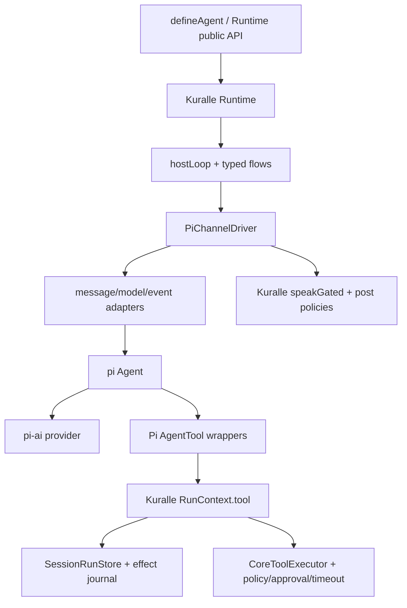

# Can Kuralle `packages/core` use `@earendil-works/pi-agent-core` as its new pi core?

Research date: 2026-07-29

Kuralle baseline: `@kuralle-agents/core@0.19.0`

Original source audit: `@earendil-works/pi-agent-core@0.80.6` and `@earendil-works/pi-ai@0.80.6`

Implemented version: `@earendil-works/pi-agent-core@0.82.1` and `@earendil-works/pi-ai@0.82.1` (local audit clones intentionally not committed)

## Implementation outcome

The recommended boundary was implemented as `@kuralle-agents/pi-driver`: Core owns orchestration, durability, tools, policies, and traces, while Pi owns the inner provider/tool loop. Pi-native typed collection and decisions are now the adapter default; applications and production examples select Pi by default, with the Core AI SDK loop retained as an explicit portability fallback.

The release candidate passed the full local package suite, 54 TypeScript configs, Worker-runtime tests, both dependency audits, and a live 40-lane CLI matrix: 20 scenarios on Pi and the same 20 on the AI SDK baseline, 62 turns per driver, with 875 OTLP spans and no failed semantic checks. The phased plan below is retained as the pre-implementation reasoning record.

## Recommendation

**Yes, use pi as an optional inner agent-loop engine. Do not rebuild or replace Kuralle Core around it wholesale.**

The right boundary is a new driver/adapter package—conceptually `@kuralle-agents/pi-core` or `@kuralle-agents/pi-driver`—that implements Kuralle's `ChannelDriver` contract while delegating the provider/tool iteration loop to pi.

Keep these Kuralle components authoritative:

- `Runtime` and `hostLoop`;
- typed flow graph and flow state;
- `RunContext` and `SessionRunStore`;
- durable effect journal and idempotency keys;
- approvals, suspend/resume, signal delivery, and escalation;
- routing and handoff semantics;
- input/output policies and guarded streaming;
- session stores, working memory, tracing, and Cloudflare bridge.

Let pi own only:

- provider stream normalization;
- assistant/tool-call iteration;
- partial message assembly;
- tool-call argument validation at its boundary;
- steering/follow-up queues where a host supports them;
- parallel/sequential scheduling mechanics;
- agent lifecycle events.

This gives Kuralle pi's well-tested loop without surrendering the features that make Kuralle distinct.

## Why the fit is attractive

Kuralle currently has three layers participating in one conversational tool loop:

- [`packages/core/src/runtime/channels/TextDriver.ts`](../../packages/core/src/runtime/channels/TextDriver.ts) — model calls, stream iteration, steps, tools, usage, and gating;
- [`packages/core/src/runtime/channels/executeModelTool.ts`](../../packages/core/src/runtime/channels/executeModelTool.ts) — batching, parallel-safety, durable callsites, and result conversion;
- [`packages/core/src/tools/effect/ToolExecutor.ts`](../../packages/core/src/tools/effect/ToolExecutor.ts) — schemas, policy, abort, timeout, progress, and execution.

pi already solves the innermost repeated pattern:

```text
provider request -> streamed assistant -> tool calls -> tool results -> next provider request
```

Its low-level `Agent` is small enough to embed and exposes the hooks Kuralle needs:

- `beforeToolCall` and `afterToolCall`;
- `transformContext` and `convertToLlm`;
- `prepareNextTurn` / `shouldStopAfterTurn`;
- `subscribe` with awaited event listeners;
- `toolExecution: parallel | sequential`;
- `prompt`, `continue`, `steer`, `followUp`, `abort`, and `waitForIdle`.

camelAI is strong evidence that this class can run inside a Cloudflare Durable Object. It is not evidence that it supplies durability: camelAI wraps it in thousands of lines of transcript, journal, and recovery code.

## Responsibility comparison

| Concern | Kuralle today | pi Agent | Proposed owner |
| --- | --- | --- | --- |
| Provider streaming | Vercel AI SDK `streamText` | `pi-ai` stream protocol | pi adapter, optionally |
| Multi-step tool loop | `TextDriver` loop | built in | pi |
| Partial text/thinking/tool events | Kuralle stream parts from AI SDK | rich `AgentEvent` stream | pi -> Kuralle event codec |
| Tool schemas | Standard Schema/Zod through AI SDK | TypeBox or plain JSON Schema at runtime | Kuralle schema adapter |
| Tool execution | `CoreToolExecutor` | calls `AgentTool.execute` | Kuralle executor behind pi tool wrappers |
| Exactly-once replay | `SessionRunStore` + effect keys | absent | Kuralle |
| Approval/suspend/resume | control-flow signals + durable journal | absent; errors are swallowed into tool results | Kuralle, with required pi hook |
| Typed flows | first-class node graph | absent | Kuralle |
| Routing/handoffs | `hostLoop` and control tools | absent | Kuralle |
| Guardrails/output gating | pre/post policies and stream modes | hooks only | Kuralle |
| Session persistence | pluggable CAS stores | `Agent` is in-memory | Kuralle |
| Durable harness recovery | implemented in Kuralle | pi document describes it as future work | Kuralle |
| CF AI Chat bridge | `@kuralle-agents/cf-agent` | absent | Kuralle |
| Compaction | Kuralle turn-level compaction | context transform; higher harness has its own compaction | Kuralle initially |
| Model ecosystem | any AI SDK 6 provider | pi-ai provider/model catalog | pluggable driver boundary |

## The critical blocker: control-flow exceptions

Kuralle's tool layer distinguishes ordinary failure from a decision to pause the run. Approval and suspend/resume work by throwing special control-flow signals. `executeModelToolCall` preserves those signals, settles any parallel siblings, and rethrows only after the batch is safely journaled. No fake tool result is shown to the model.

pi's `executePreparedToolCall` catches every exception from `AgentTool.execute` and converts it into an error `AgentToolResult`. `prepareToolCall` and `afterToolCall` similarly contain hook exceptions. As shipped, a Kuralle suspend signal would become model-visible error text and pi could continue the loop. That breaks the durable protocol.

This must be adapted explicitly before the pi driver is allowed to run tools that can approve, suspend, or otherwise unwind control flow. It does **not** necessarily require a fork.

A Kuralle tool wrapper can catch only `SuspendError`, retain it in an out-of-band per-turn signal box, and resolve to a hidden terminating placeholder. Then:

1. pi is allowed to settle every already-started sibling tool;
2. `shouldStopAfterTurn` sees the captured signal and prevents the next provider request;
3. the driver converts and durably attaches the interrupted assistant/tool continuation;
4. the driver suppresses the placeholder from Kuralle's UI/canonical transcript;
5. after pi settles, the driver rethrows the original signal to Kuralle's `hostLoop`.

This works because the per-turn pi transcript is disposable and Kuralle remains the only persistent transcript authority. It must be proven with crash injection around every step; persisting pi's placeholder would be incorrect.

A cleaner long-term option is an upstream first-class control-signal hook, conceptually:

```ts
interface AgentOptions {
  classifyToolControlSignal?: (error: unknown) => unknown | undefined;
}
```

That upstream feature must preserve pi's sibling-settlement guarantee; a naive immediate rethrow from a `Promise.all` batch would recreate the exact abandoned-journal-write problem Kuralle already prevents. Kuralle would classify `SuspendError`, pi would settle the batch, and the control outcome would then escape without a model-visible tool result. The existing default could remain unchanged, making this a backward-compatible contribution rather than a permanent private fork.

The safest initial spike scope is still **non-interruptible free-conversation tools only**. Add the signal-box path only in the dedicated approval/resume phase, with tests proving its placeholder never enters persistent or user-visible history.

## The second blocker: model and message types

Kuralle's public API accepts Vercel AI SDK 6 `LanguageModel` instances and stores AI SDK `ModelMessage[]`. pi uses its own `Model`, `Message`, `AssistantMessage`, and provider event protocol.

There are two integration choices:

### A. pi-ai-native driver

Add a separate driver whose agent configuration accepts a pi model reference. Convert Kuralle messages and tools into pi shapes.

Advantages:

- receives pi's full provider normalization and agent loop;
- closest to the proven camelAI integration;
- fewer layers during a model call.

Costs:

- Kuralle users cannot automatically pass arbitrary AI SDK providers/middleware;
- model configuration becomes a tagged union or driver-specific field;
- usage, cache, provider options, and structured-generation paths need adapters;
- pi's package currently declares Node `>=22.19`, while Kuralle's Cloudflare package declares Node `>=20`.

### B. AI-SDK-backed pi `streamFn`

Keep Kuralle `LanguageModel`, but implement pi's `StreamFn` by translating AI SDK `streamText().fullStream` into pi assistant events.

Advantages:

- preserves Kuralle's existing provider ecosystem and public model API;
- permits gradual adoption per driver.

Costs:

- the event adapter must correctly assemble text, thinking, tool calls, usage, stop reasons, provider errors, and aborts;
- it duplicates part of what pi-ai exists to do;
- it retains two message/protocol abstractions in the hot path.

For a first production path, choose **A in a separate optional package**. It creates a clean experimental boundary. Revisit B only if preserving arbitrary AI SDK provider compatibility proves more valuable than the protocol complexity.

Do not copy camelAI's import of `@earendil-works/pi-ai/compat` as a new foundation. That source file explicitly labels itself temporary and says it will be deleted after the coding-agent model-manager migration. Target pi's current `Models`/provider APIs behind your own adapter.

## Tool adaptation

A Kuralle `AnyTool` can be projected to a pi `AgentTool`:

```ts
function toPiTool(def: AnyTool, ctx: RunContext): AgentTool {
  return {
    name: def.name,
    label: def.name,
    description: def.description,
    parameters: await asSchema(def.input ?? permissiveObjectSchema).jsonSchema,
    executionMode:
      def.parallelSafe === true || def.replay === false ? 'parallel' : 'sequential',
    execute: async (toolCallId, args, signal, update) => {
      const value = await ctx.tool(def.name, args, {
        toolCallId,
        // callsite/index allocated deterministically during preflight
      });
      return {
        content: [{ type: 'text', text: stableSerialize(value) }],
        details: value,
      };
    },
  };
}
```

pi's current validator can compile plain JSON Schema in addition to TypeBox-tagged schemas, which makes AI SDK's `asSchema(...).jsonSchema` a viable bridge. Kuralle's own `CoreToolExecutor` must remain the final validator and executor because it owns policy, timeout, progress, output validation, and failure semantics.

### Deterministic parallel callsites

Do not allocate Kuralle effect callsites inside concurrently starting pi tool promises. Replay identity must not depend on scheduler timing.

Use pi's sequential preflight hook to reserve/map callsites by tool-call ID before execution, or add a batch-preflight hook upstream. For a batch:

1. reserve callsites in assistant source order;
2. compute effect keys in that order;
3. reserve journal step indices for unresolved parallel-safe calls;
4. store `{ toolCallId -> callsite, stepIndex }`;
5. let pi execute wrappers concurrently;
6. have each wrapper call `ctx.tool` with its preassigned coordinates.

Kuralle's existing guarantee that unsafe tools serialize should map conservatively to pi. In pi, one tool marked `executionMode: 'sequential'` makes the entire assistant batch sequential, which is safe though potentially less concurrent than Kuralle's contiguous parallel-group scheduler.

## Control tools and outer-loop ownership

`enter_flow`, `transfer_to_agent`, `end`, and escalation are not normal conversational results. Kuralle's `hostLoop` must remain their owner.

The pi driver should:

1. expose Kuralle's control tools as pi wrappers;
2. capture the first valid `TurnControl` value returned by a wrapper;
3. let already-started siblings settle and journal;
4. return `true` from pi's `shouldStopAfterTurn` when control has been captured;
5. return that captured control in Kuralle's `TurnResult`;
6. let `hostLoop` enter the flow, hand off, pause, or end.

This preserves the rule that pi owns only the inner loop. It also prevents pi from starting another provider call after the model has already chosen a Kuralle control transition.

## Streaming and policies

pi's awaited event stream is a good match for Kuralle's `TokenSource` abstraction:

- `message_update/text_delta` -> token delta;
- thinking events -> internal reasoning parts if enabled;
- tool execution events -> existing internal `tool-call`/`tool-result` parts;
- usage from final pi assistant messages -> Kuralle turn-usage snapshot;
- `agent_end` -> settlement barrier, not directly the Kuralle `done` event.

Feed pi text deltas through Kuralle's existing `speakGated`/`speakWithHostControl` path. Do not stream directly from pi to the UI, or strict output policies, sentence-level validation, redaction, and host-control buffering will be bypassed.

Pre-turn guardrails and gather/RAG continue before pi is instantiated. Post-turn policy still evaluates the assembled answer after pi settles. Kuralle, not pi, decides what is persisted as the canonical assistant output.

## Compaction, sessions, and Cloudflare

Use pi's low-level `Agent`, not `AgentHarness`, in the first integration.

Reasons:

- Kuralle already has a durable session and effect journal;
- `@kuralle-agents/cf-agent` already splits CF UI messages from orchestration state;
- pi `AgentHarness` introduces a second session tree, leaf model, compaction log, filesystem/environment abstraction, and tool registry;
- its own durable design notes say queue, operation, provider-request, and tool-call recovery are not yet a completed fully durable runtime;
- stacking it would create two or three competing transcript authorities.

Instantiate a pi `Agent` per Kuralle driver turn from the current durable Kuralle state. Treat the object as disposable. If Kuralle later adopts a thread actor that keeps it warm, the durable Kuralle transcript/journal still remains authoritative after eviction—the same principle camelAI follows.

Keep Kuralle compaction initially. Provide pi with the already-compacted Kuralle message view. Do not run both compaction systems against the same history.

## Proposed package boundary



Suggested dependency direction:

```text
@kuralle-agents/core          (must not depend on pi)
        ^
        |
@kuralle-agents/pi-driver     (depends on core + pi-agent-core + pi-ai)
        ^
        |
application / cf-agent subclass opts into PiChannelDriver
```

This prevents a 0.x third-party runtime from becoming a mandatory transitive dependency and protects the stable core API.

Core already exposes the immediate seam as `Runtime.run({ driver })`. The Cloudflare adapter does not currently pass one: `KuralleAgent.onChatMessage()` calls `runtime.run(...)` without a driver. A usable integration therefore also needs a protected `getChannelDriver()` hook (or a runtime-level default-driver option) in `@kuralle-agents/cf-agent`; otherwise every Cloudflare consumer would have to override the whole chat method merely to select pi.

## Phased adoption plan

### Phase 0 — lock the contract

Before adding the dependency, extract black-box contract tests for the current `TextDriver`:

- text-only streaming and finish reasons;
- one and multiple tool calls;
- mixed safe/unsafe parallel batches;
- stable journal keys across replay;
- tool progress, timeout, abort, and schema failure;
- control-tool break before another model call;
- post-policy block/rewrite;
- context-overflow retry and compaction;
- usage aggregation and provider cache fields;
- no internal control leakage into the user transcript.

### Phase 1 — read-only, no-tool spike

Build `PiChannelDriver` for a pi-native model and text streaming only. Run it against the same conversation/eval fixtures as `TextDriver`. Prove Workers bundling and memory footprint.

### Phase 2 — ordinary durable tools

Add schema/message/result codecs and Kuralle executor wrappers for tools that cannot suspend. Prove replay and parallel callsite determinism under randomized delays and injected crashes.

### Phase 3 — control-flow escape

Implement the signal-box adapter described above and add approval/suspend/resume crash tests. In parallel, propose a batch-safe first-class control-signal outcome upstream; adopt it later if accepted.

### Phase 4 — control tools and flows

Capture Kuralle control results, stop pi after the completed batch, and return control to `hostLoop`. Run every existing routing, handoff, flow-entry, escalation, and control-leak test against both drivers.

### Phase 5 — steering and warm actor use

Only after the disposable-per-turn path is correct, expose pi steering/follow-up for hosts that have a serialized actor. Durable-queue semantics remain the host's responsibility.

### Phase 6 — decide the default

Compare both engines on:

- correctness/eval pass rate;
- first-token and total turn latency;
- prompt-cache behavior;
- Worker bundle and isolate memory;
- provider coverage;
- maintenance LOC and regression rate;
- durability fault-injection results.

Make pi the default only if it wins on measured outcomes. Retain the driver interface so the decision remains reversible.

## Acceptance gates

The migration is not ready to ship unless all of these are true:

- [ ] Existing public `defineAgent`, flow, and tool authoring APIs do not require pi types.
- [ ] A suspended tool produces no model-visible synthetic error result.
- [ ] Duplicate/replayed turns do not execute a replayable side effect twice.
- [ ] Parallel tool effect keys are deterministic under randomized completion order.
- [ ] One control tool prevents another provider turn after the current batch settles.
- [ ] Strict output gating and redaction still see all text before the user does.
- [ ] Context-overflow recovery performs at most the intended retry.
- [ ] AI SDK UI stream parts remain wire-compatible for existing clients.
- [ ] CF Durable Object eviction/reconstruction does not depend on pi object memory.
- [ ] Bundle size and 128 MB Worker memory fit are measured, not assumed.
- [ ] Provider usage and prompt-cache accounting match existing semantics.
- [ ] The exact pi version and license are pinned and recorded.

## Go/no-go answer

### Go

- Create an optional pi driver package.
- Use the low-level pi `Agent` as the inner loop.
- Keep Kuralle orchestration and durability above it.
- Start with a pi-native model path and non-interruptible tools.
- Implement a carefully isolated signal-box adapter, and pursue a batch-safe upstream control-signal hook to simplify it later.

### No-go

- Do not replace `packages/core` wholesale.
- Do not use pi `AgentHarness` as a second durable session runtime.
- Do not route Kuralle tools directly through pi without the durable `RunContext.tool` path.
- Do not enable approvals/suspension until special exceptions can escape pi.
- Do not couple new code to pi-ai's explicitly temporary `/compat` entrypoint.
- Do not remove the existing driver until a fault-injection/eval comparison proves parity.

The hunch is sound: pi can eliminate a meaningful amount of fragile inner-loop machinery and give Kuralle a better coding-agent execution engine. The winning design is **Kuralle outside, pi inside**, with a narrow adapter and an explicit, batch-safe control-signal path—not “pi becomes Kuralle Core.”
