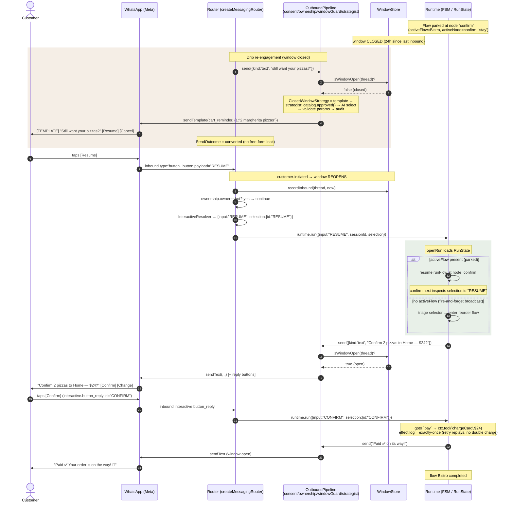

## 6. Pseudocode

### 6.1 Outbound pipeline + window guard (the leak guarantee)

```
FUNCTION pipeline.send(req):              # req.payload, req.meta.window
    RETURN chain[0].send(req, () => chain[1].send(req, () => ... sink(req)))

# consentGate
FUNCTION consentGate.send(req, next):
    IF NOT consent.isOptedIn(req.threadId):
        RETURN { kind: 'deferred', reason: 'not-opted-in' }
    RETURN next(req)

# ownershipGate
FUNCTION ownershipGate.send(req, next):
    IF ownership.owner(req.threadId) == 'human':
        RETURN { kind: 'suppressed', reason: 'human-owned' }
    RETURN next(req)

# windowGuard (NON-REMOVABLE; gates EVERY non-template payload — R-01; channel-agnostic via ChannelPolicy — rev3)
FUNCTION windowGuard.send(req, next):
    policy = policyFor(req.platform)            # injected ChannelPolicy (§4.12)
    IF req.payload.kind == 'template':          # an already-recovered payload
        RETURN next(req)
    IF (NOT policy.hasWindow) OR policy.isWindowOpen(req.threadId):   # web: hasWindow=false => always pass
        RETURN next(req)                         # in-window: text / media / interactive all allowed
    # closed window: apply the channel's ClosedWindowStrategy — never forward free-form
    SWITCH policy.closedWindow.kind:
        'none':        RETURN { kind:'deferred', reason:'window-closed-no-recovery' }   # web n/a; IG when no tag
        'message-tag':                            # IG human-agent tag — TEXT ONLY (IG-CW, rev4)
            IF req.payload.kind == 'text':
                RETURN next({ ...req, payload: taggedText(req.payload, policy.closedWindow.tag) })  # sendTextWithTag
            RETURN { kind:'deferred', reason:'window-closed-tag-text-only' }   # interactive/media can't be tagged
        'template':                              # WhatsApp: delegate to the smart-send strategist (§6.2)
            decision = policy.closedWindow.strategist.decide({ requested: req.payload, window, catalog, context: req.meta })
            SWITCH decision.kind:
                'freeform': RETURN { kind:'deferred', reason:'window-closed-no-fallback' }
                'template': RETURN next({ ...req, payload: { kind:'template', template: decision.template } })
                'defer':    RETURN { kind:'deferred', reason: decision.reason }

# sink (terminal): maps payload to the capability-detected client method
FUNCTION sink(req):
    SWITCH req.payload.kind:
        'text':        RETURN { kind:'sent', result: client.sendText(req.threadId, text) }
        'interactive': RETURN { kind:'sent', result: client.sendInteractive(...) }
        'media':       RETURN { kind:'sent', result: client.sendMedia(...) }
        'template':    IF NOT isTemplateCapable(client): THROW 'no template capability'
                       RETURN { kind:'converted', result: client.sendTemplate(...), ... }
```

Invariant: the sink emits a free-form payload (text, media, OR interactive) only when `windowGuard` forwarded it, and `windowGuard` forwards a non-template payload only when `window.open`. Templates are the sole window-agnostic payload. Therefore a closed-window free-form leak of ANY kind is impossible by construction (REQ-1/REQ-16). **This holds only if every send traverses the pipeline (REQ-17):** the router `fallbackMessage` and any custom `responseMapper` MUST emit through the pipeline, not call the client directly (today `createMessagingRouter.ts:81` and `stream-mapper.ts:82-89` bypass it — both are reshaped).

### 6.2 Strategist (guardrails OUTSIDE the AI)

```
FUNCTION strategist.decide(input):
    IF input.window.open: RETURN { kind:'freeform', text: input.requested.text }   # REQ-6
    candidates = catalog.approved()                       # guardrail (a): APPROVED + non-paused only
    IF candidates is empty: RETURN { kind:'defer', reason:'no-approved-template' }
    pick = selector.select({ text, intent, candidates, flowState })   # AI seam (mockable)
    IF pick is null: RETURN { kind:'defer', reason:'no-template-fit' }
    v = catalog.validateParams(pick.name, pick.params)    # guardrail (b)
    IF NOT v.ok: RETURN { kind:'defer', reason:'param-validation-failed' }
    audit.record({ requestedText, chosenTemplate: pick.name, params: pick.params, at: now })  # (d)
    RETURN { kind:'template', template: toOutboundTemplate(pick), selected, audit }
```

### 6.3 Inbound resolution (stable-id routing)

```
FUNCTION InboundResolverChain.resolve(message):
    FOR plugin IN plugins:                 # [InteractiveResolver, TextResolver]
        r = plugin.tryResolve(message)
        IF r != undefined: RETURN r
    THROW 'no resolver matched'

FUNCTION InteractiveResolver.tryResolve(m):
    IF m.interactive?.id:  RETURN { input: m.interactive.id, selection: { id: m.interactive.id } }
    IF m.button?.payload:  RETURN { input: m.button.payload, selection: { id: m.button.payload } }
    IF m.interactive?.formResponse:  RETURN { input: '__flow__', selection: { formData: m.interactive.formResponse } }
    RETURN undefined                       # defer to TextResolver
```

The router calls `runtime.run({ input, sessionId, userId, selection })` — `RunOptions` gains an optional `selection: ResolvedSelection` (core change, §4.8). At turn start the runtime merges `selection.formData` into the run's flow state and exposes `selection.id` as `input`; `decide`/`collect` route on the stable id. Free text → `TextResolver` → `input = message.text` → NLU as before. (Today `RunOptions` is `input?: string` only — `Runtime.ts:51`, `openRun.ts:77-92`; §4.8 is the concrete mechanism, not run-context hand-waving — R-03.)

### 6.4 Interactive render (on node entry)

```
# collect/decide with withChoices(...) metadata emits, at node entry:
EMIT { type:'interactive', nodeId, options, prompt }

# interactiveRenderer middleware (consumes the stream part instead of sending text):
FUNCTION interactiveRenderer.send(req, next):
    part = find(req.meta.parts, type=='interactive')
    IF NOT part: RETURN next(req)
    msg = renderToWhatsApp(part.options, part.prompt)   # ≤3 → buttons, 4..10 → list, url → cta, flow → flow
    ASSERT within limits ELSE THROW
    RETURN next({ ...req, payload: { kind:'interactive', interactive: msg } })
```

### 6.5 Proactive (broadcast / drip)

```
# R-07: do NOT rely on the per-run effect log for broadcast idempotency — runId == sessionId
# (openRun.ts:31), so it dedupes WITHIN a conversation, not per (campaign, recipient). RunOptions
# has no `seed` (Runtime.ts:51). Use an explicit BroadcastLedger + send via the pipeline.
FUNCTION broadcasts.send(campaign):
    FOR recipient IN campaign.recipients WHERE consent.isOptedIn(recipient.customerId):
        key = (campaign.id, recipient.customerId)
        IF NOT broadcastLedger.putIfAbsent(key): CONTINUE     # atomic; idempotent under retry
        pipeline.send({ threadId: recipient.threadId, platform,   # window/consent/ownership still apply
                        payload: { kind:'template', template: campaign.template },
                        meta: metaFor(recipient) })
# The recipient's REPLY arrives as a normal inbound -> the router runs the flow (hostLoop triage/resume).

FUNCTION drip.scheduleNext(threadId, step):
    IF session.campaign.stoppedOnReply: RETURN
    scheduler.enqueue({ threadId, step }, { delayMs: step.delay })
# On inbound: set session.campaign.stoppedOnReply = true (stop-on-reply, REQ-13).
# Re-engagement-after-window: a scheduled step sends an approved template; the resumed flow
# continues via the normal inbound path once the user replies (reopening the window).

# Inbound ownership gate (R-08) — runs in the router BEFORE runtime.run:
FUNCTION onInbound(message):
    record(message)                              # always persist to history
    IF ownership.owner(message.threadId) == 'human':
        RETURN                                   # human-owned: do NOT run the flow (no side effects)
    { input, selection } = inboundChain.resolve(message)
    runtime.run({ input, sessionId, userId: message.customerId, selection })
```

### 6.6 Template-reply lifecycle (sequence)

End-to-end: a flow parks at a node, the window closes, a drip re-engages via an approved template (closed-window strategy), the customer's template-button reply reopens the window, and the durable FSM resumes at the exact parked node. The window gate and the conversation FSM are orthogonal — the window governs *what may be sent*; `RunState` governs *where the conversation is*.



**Branch — `[Talk to staff]`:** the flow `escalate`s → `ownership.claim(human)`; the inbound ownership gate then records customer messages but does **not** run the flow (bot silent) until release. **Omnichannel:** identical sequence on **web** (window always open → step 5–9 send a normal message, no template) and **Instagram** (closed-window uses the `HUMAN_AGENT` tag instead of a template; buttons render as quick-replies/carousel) — only the injected `ChannelPolicy` differs.

## 7. Code Blueprint

Structural sketch only — actual signatures in §4. Naming/paths are committed.

```ts
// packages/kuralle-messaging/src/adapter/outbound-pipeline.ts
export class OutboundPipeline {
  constructor(private mw: OutboundMiddleware[], private sink: OutboundSink) {
    if (!mw.some(m => m.name === 'window-guard'))
      throw new Error('window-guard middleware is required (window safety)'); // REQ-2
  }
  send(req: OutboundRequest): Promise<SendOutcome> {
    const run = (i: number, r: OutboundRequest): Promise<SendOutcome> =>
      i < this.mw.length ? this.mw[i].send(r, (nr) => run(i + 1, nr)) : this.terminal(r);
    return run(0, req);
  }
  private terminal(r: OutboundRequest): Promise<SendOutcome> { /* §6.1 sink */ }
}
```

```ts
// packages/kuralle-messaging/src/adapter/createMessagingRouter.ts  (modified)
// inbound: replace `input = message.text ?? '[type]'` with the resolver chain.
const { input, selection } = await inboundChain.resolve(message);
const handle = config.runtime.run({ input, sessionId, userId, /* selection merged via run-context */ });
// outbound: StreamMapper feeds collected parts into the OutboundPipeline instead of sendText().
await pipeline.send({ threadId, platform, payload, meta: { window: tracker.state(threadId), parts, sessionId } });
```

```ts
// packages/kuralle-whatsapp-engagement/src/strategist.ts
export function createSmartSendStrategist(opts: {
  catalog: TemplateCatalog; selector: TemplateSelector; audit: AuditSink;
}): SmartSendStrategist { /* §6.2 */ }
```

```ts
// packages/kuralle-messaging-meta/src/whatsapp/client.ts  (modified toInboundMessage)
interactive: msg.interactive ? {
  type: msg.interactive.type,
  id: msg.interactive.button_reply?.id ?? msg.interactive.list_reply?.id ?? '',
  title: /* ...as today... */,
  description: msg.interactive.list_reply?.description,
  formResponse: msg.interactive.nfm_reply         // NEW: parse response_json
    ? safeJsonParse(msg.interactive.nfm_reply.response_json) : undefined,
} : undefined,
```

```ts
// packages/kuralle-core/src/types/stream.ts  (additive)
export type HarnessStreamPart =
  | /* ...existing... */
  | { type: 'interactive'; nodeId: string; options: ChoiceOption[]; prompt: string };
```

```ts
// authoring (example) — packages/kuralle-messaging-meta/examples/multi-platform/server.ts
const triage = withChoices(
  decide({ id: 'triage', instructions: 'Route the request.', schema: TriageSchema,
           decide: (sel) => sel === 'billing' ? { goto: billing } : sel === 'agent' ? { escalate: 'support' } : { goto: support } }),
  [{ id: 'billing', label: 'Billing' }, { id: 'support', label: 'Support' }, { id: 'agent', label: 'Talk to a human' }],
);
const engagement = whatsappEngagement({ client: whatsapp, selector: aiTemplateSelector(model) });
const router = createMessagingRouter({ runtime, platforms: { whatsapp, messenger }, ...engagement.bridge });
```
